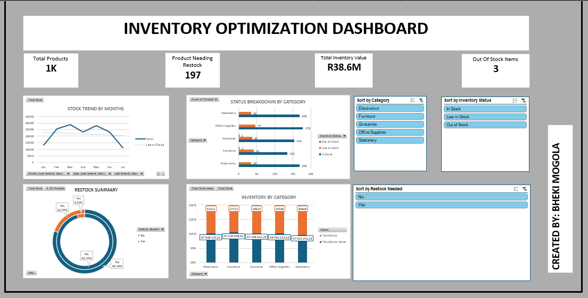

# 📊 Inventory Optimization Dashboard (MICROSOFT EXCEL)

A professional, KPI-driven Excel dashboard that provides powerful insights into inventory performance, stock value, restocking needs, and category-level trends. Built entirely in Microsoft Excel with dynamic pivot tables, charts, and slicers for business-level decision making.

---

## 📌 Project Overview

The **Inventory Optimization Dashboard** helps inventory managers and business analysts:
- Monitor current stock levels across product categories
- Identify restocking needs quickly
- Track stock movement trends by month
- Visualize value locked in inventory
- Make informed decisions based on interactive insights

---

## 🎯 Objective

To build a **real-world, executive-level Excel dashboard** that can:
- Highlight potential stock issues
- Help avoid stockouts
- Improve inventory replenishment decisions
- Enable category and status-level analysis with filters

---

## 🛠 Tools & Techniques Used

- **Microsoft Excel** (PivotTables, PivotCharts, Slicers, Formulas, Conditional Formatting)
- **Data Cleaning** (Removing NaNs, adjusting mismatched columns, fixing formats)
- **Calculated Logic Columns** (Inventory Status, Restock Flags)
- **Dashboard Design** (Grid layout, KPIs, dynamic filters, responsive charts)

---

## 🧩 Dataset Description

A generated dataset of **1,000 products** across categories:
- Electronics, Furniture, Office Supplies, Groceries, Stationery
- Fields include: `Product ID`, `Product Name`, `Category`, `Quantity in Stock`, `Restock Level`, `Stock Value`, `Last Restock Date`

---

## 🧠 Methodology (Steps Taken)

### ✅ Phase 1: Dataset Setup
- Loaded clean inventory dataset
- Checked for missing data and corrected misaligned fields

### ✅ Phase 2: Preprocessing
- Created Excel Table from dataset
- Added logic columns:
  - `Restock Needed?` → If quantity < restock level
  - `Inventory Status` → Out of Stock, Low, In Stock

### ✅ Phase 3: Analysis
Created 4 key PivotTables:
1. **Inventory by Category**
2. **Restock Summary**
3. **Status Breakdown by Category**
4. **Monthly Stock Trend**

### ✅ Phase 4: Visualization
- Created PivotCharts for each table
- Inserted Slicers for filtering by:
  - Category
  - Restock Needed
  - Inventory Status
- Designed KPIs for:
  - Total Products
  - Products Needing Restock
  - Total Inventory Value
  - Out of Stock Items

---

## 📌 Key Insights

- 📦 **19.7% of products** need to be restocked
- ⚠️ Only **3 products are currently out of stock**, but over **190 are low**
- 🛒 The category with the **highest stock value** is *Electronics*
- 📉 Inventory levels fluctuate monthly with slight dips in May and July

These insights help reduce **stockouts**, optimize **inventory holding costs**, and plan **restocking schedules** better.

---

## 🖼️ Dashboard Screenshot

---

## 🧪 How to Use

1. Open the Excel file: `Inventory_Optimization_Dashboard.xlsx`
2. Navigate to the `Dashboard` sheet
3. Use the slicers to filter by:
   - Product Category
   - Inventory Status
   - Restock Need
4. Read insights via KPI cards and dynamic charts

---

## 📁 Files Included

- `Inventory_Optimization_Dashboard.xlsx`
- `Dashboard Screenshot.png`
- `README.md`

---

## 📬 Contact

**Created by:** [Bheki Mogola](https://www.linkedin.com/in/bheki-mogola-8481122b7)  
📧 bhekimogola123@gmail.com  
📍 South Africa

---

## ⭐️ If you like this project, please give it a star and share!

